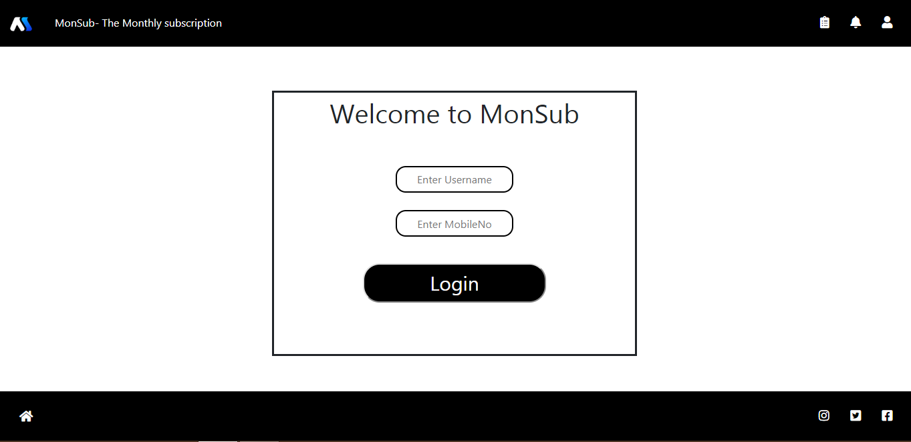
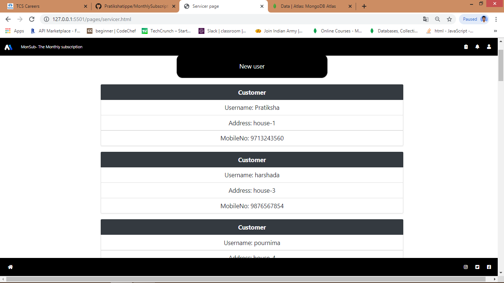
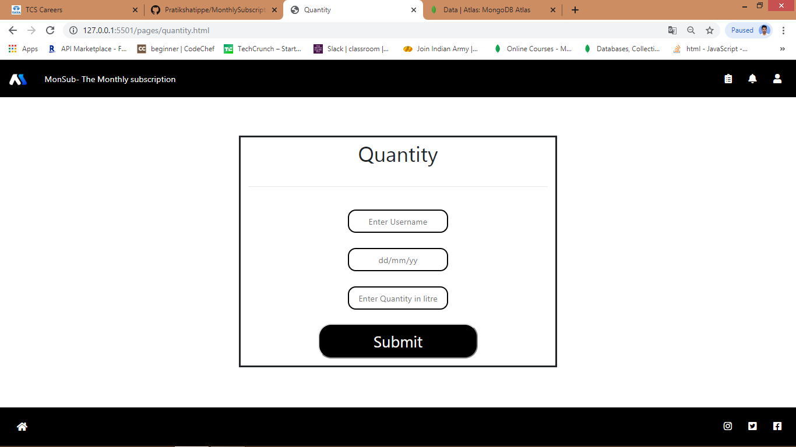
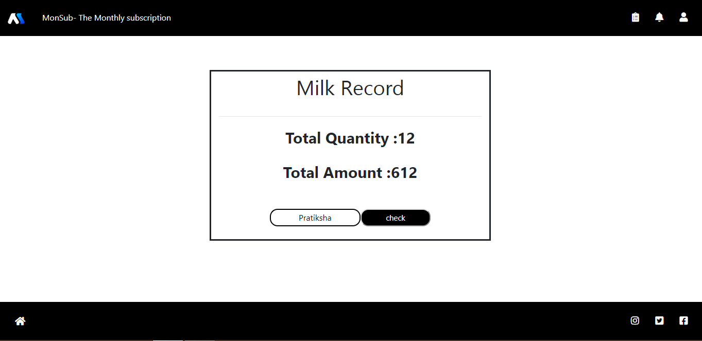

# Application Name
 MonSub - The Monthly Subscription Milk Management Application
## Author
* Pratiksha Tippe
* Robin Hooda
## Details
The monthly subscription management shows the record of the month for daily expenditure like total cost of milk, total cost of newspaper. There are mainly two modules first one customer and second is servicer. In servicer milkman, newspaper are included as sub module. All record is displayed in report sub module which is in servicer module.

Note: As now, we are only considering management of milk
## Testing
Username:Chinu, Mobile No: 7798066647
## Technology
* HTML
* CSS
* JavaScript
* Bootstrap
* NodeJS
* MongoDB
* ExpressJS
## Design

